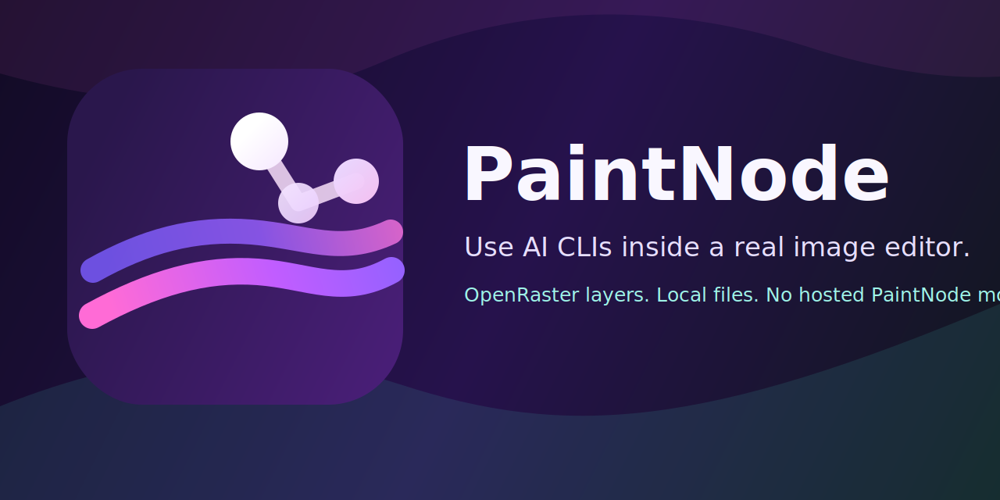
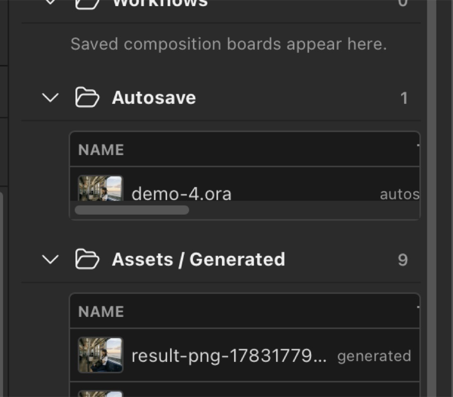
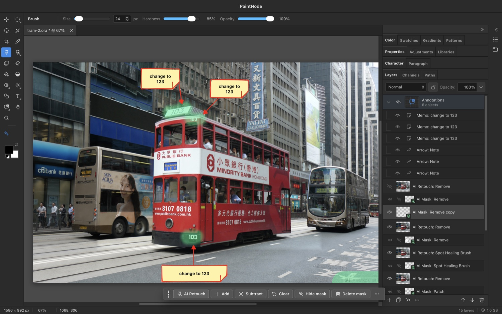
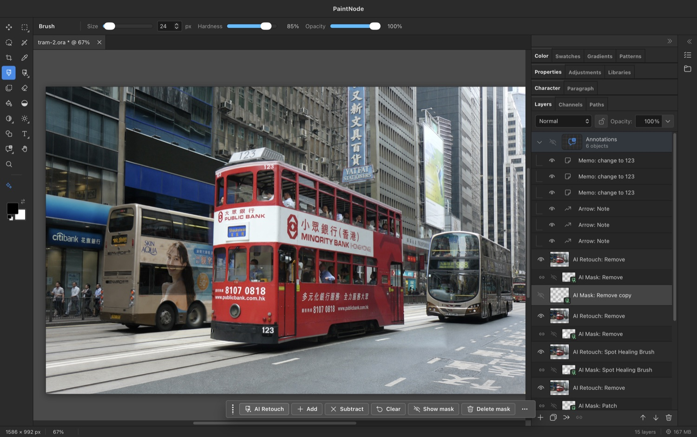

<p align="center">
  <a href="https://paintnode.com">
    
  </a>
</p>

<h1 align="center">PaintNode</h1>

<p align="center">
  <strong>Use Codex CLI and Antigravity inside a real image editor.</strong>
</p>

<p align="center">
  <a href="https://paintnode.com">Website</a>
  |
  <a href="https://paintnode.com/download">Download</a>
  |
  <a href="https://github.com/white-cornerstone/paintnode/releases/latest">Latest release</a>
  |
  <a href="docs/release.md">Release docs</a>
</p>

> PaintNode is still a very early first version. Some tools and modules are not
> complete yet, and the editor will keep improving step by step across future
> releases.

PaintNode is a free, open-source, backend-free raster image editor for people
who already use AI CLIs. Start from a blank canvas, an image, a mask, or a
layered project, mark the exact areas that need attention, then ask Codex CLI or
Antigravity to generate, retouch, fill, replace, or extract pixels directly into
an editable document.

The point is simple: AI image output should land as layers, masks, selections,
and reusable project assets, not as a pile of loose PNGs in a downloads folder.
PaintNode keeps the work in portable OpenRaster (`.ora`) files you own, with PNG
and PSD export paths when you need to hand work off.

Annotations are part of that workflow. Use arrows, memos, callouts, badges, and
dividers to tell the AI agent exactly what should change and where. They can
stand alone as an editable annotation layer for review, or travel with an AI
retouch brush mask so the agent sees both the target pixels and your written
instructions.

No hosted PaintNode model. No extra API-key billing layer. PaintNode uses the
CLI login, subscriptions, limits, and local files already configured on your
machine.

<p align="center">
  <a href="https://paintnode.com">
    
  </a>
</p>

## Feature Gallery

<table>
  <tr>
    <td width="50%">
      
      <br>
      <strong>Prompt inside the editor</strong>
      <br>
      Start from the canvas, a selection, a mask, or a project asset and send the job to your local AI CLI.
    </td>
    <td width="50%">
      
      <br>
      <strong>Choose the provider per run</strong>
      <br>
      Use app defaults, then override provider, model, reasoning effort, or service tier when a specific task needs it.
    </td>
  </tr>
  <tr>
    <td width="50%">
      
      <br>
      <strong>Review retouch results</strong>
      <br>
      Compare the source, mask, and generated result before committing an AI retouch back into the document.
    </td>
    <td width="50%">
      
      <br>
      <strong>Keep project assets together</strong>
      <br>
      Documents, storyboards, workflows, autosaves, and AI tasks stay organized around the current project.
    </td>
  </tr>
  <tr>
    <td width="50%">
      
      <br>
      <strong>Codex CLI and Antigravity</strong>
      <br>
      Run different providers on the same project through separate tasks, assets, and layers.
    </td>
    <td width="50%">
      
      <br>
      <strong>A real editing workspace</strong>
      <br>
      Layers, masks, selections, color controls, project files, and exports sit around the AI workflow.
    </td>
  </tr>
</table>

### Annotation-Guided Retouching

Annotations are not just visual comments. Visible annotation text is passed into
AI retouch requests as direct user instructions for the regions the annotations
point to.

<table>
  <tr>
    <td width="50%">
      
      <br>
      <strong>Mark exactly what should change</strong>
      <br>
      Use arrows, memos, and callouts to point the agent at the precise regions that need work.
    </td>
    <td width="50%">
      
      <br>
      <strong>Reduce missed or over-broad edits</strong>
      <br>
      Pair annotation notes with an AI retouch brush mask so the agent sees both the target pixels and the requested outcome.
    </td>
  </tr>
</table>

## What You Can Do

| Workflow | What happens |
| --- | --- |
| Generate onto the canvas | Write a prompt and place the generated result directly into the current document as a new layer. |
| Mask fill and replace | Paint a mask over a region and let the CLI fill or replace just that part of the image. |
| Retouch in place | Clean up or adjust a selected area while keeping the original document open and intact. |
| Guide with annotations | Add arrows, memos, callouts, badges, or dividers so the AI knows what to change without guessing or over-editing. |
| Extract assets | Pull foreground objects or reusable visual elements into standalone project files. |
| Mix provider runs | Use Codex CLI and Antigravity on the same project through separate tasks, assets, and layers. |
| Keep layered files | Save portable OpenRaster (`.ora`) documents, then export to PNG or PSD when needed. |

## How It Works

1. **Select and prompt**
   Start from a blank canvas, existing image, mask, selection, or layered
   OpenRaster project, then describe the edit in the editor.

2. **Annotate the intent**
   Drop editable arrows, memos, callouts, badges, or dividers onto the canvas to
   show exactly which regions need attention and what should happen there.

3. **Your CLI does the work**
   PaintNode hands the job to Codex CLI or Antigravity on your machine, using
   your existing local login and subscription. Visible annotations are included
   as direct user instructions for the regions they point to.

4. **Results land in your document**
   Generated images, fills, retouches, and extracted assets come back as
   editable layers and project files so you can review, revise, compose, and
   export without leaving the editor.

## Who It Is For

- **Codex CLI and Antigravity users** who want AI image work to land in an
  editable project instead of a folder of one-off images.
- **Developers and designers** making app mockups, product visuals, game
  assets, storyboards, thumbnails, marketing images, or UI concepts.
- **Local-first creators** who want open project files, readable source, and
  their existing CLI setup instead of another hosted image account.

PaintNode is an early MVP, not a replacement for every mature raster editor. It
is focused on making AI CLI output useful in a practical image-editing workflow:
layers, masks, selections, assets, project files, review, edit, export.

## Highlights

- AI image flows for generation, mask fill, replacement, retouching, asset
  extraction, and workflow composition.
- Editable annotation overlays for arrows, memos, callouts, badges, and dividers
  that can stand alone or guide AI retouch brush work.
- Provider settings for local CLIs, including Codex CLI and Antigravity, with
  per-run overrides.
- Side-by-side provider work on the same project through separate assets, tasks,
  and layers.
- Layered OpenRaster (`.ora`) documents for portable, user-owned creative files.
- PNG and PSD export paths for sharing and downstream editing.
- Local-first file I/O and project asset management.
- macOS Quick Look extensions for ORA thumbnail and preview support.
- Tauri desktop app built with Svelte 5, TypeScript, Rust, and Canvas2D.
- Signed macOS builds and signed Tauri updater metadata from GitHub Releases.
- GPL-3.0-or-later source code.

## Trust Model

PaintNode is designed to be transparent about where work happens:

- **No hosted PaintNode model** - AI work runs through the local CLIs you choose.
- **No PaintNode prompt proxy** - PaintNode does not run a hosted service that
  sits between you and your provider.
- **Your files stay as files** - projects are local OpenRaster documents and
  project assets.
- **Open source editor code** - the application source is public and licensed
  under GPL-3.0-or-later.

Some optional integrations can still contact external services or local tools
you configure, such as a provider CLI or browser-side asset search. PaintNode's
promise is that there is no PaintNode-hosted image model or billing layer.

## Status

PaintNode is in early MVP development. Public releases are intended to test the
Codex CLI and Antigravity image workflows, the layered document model, and the
desktop packaging/update flow. The editor surface, provider contracts, and file
compatibility are still evolving.

The current release channel is hosted on GitHub Releases:

```text
https://github.com/white-cornerstone/paintnode/releases
```

## Download

Download the latest public build from:

[github.com/white-cornerstone/paintnode/releases/latest](https://github.com/white-cornerstone/paintnode/releases/latest)

macOS builds are signed and notarized by White Cornerstone Pty Ltd. PaintNode
also checks GitHub Releases for signed Tauri updater metadata.

## Development

Requirements:

- Node.js 22 or newer
- Rust stable
- macOS for signed/notarized macOS release builds
- Optional local AI CLIs for AI features, such as Codex CLI or Antigravity

Install dependencies:

```bash
npm ci
```

Run the web development server:

```bash
npm run dev
```

Run the Tauri desktop app in development:

```bash
npm run tauri:dev
```

Build the static web app:

```bash
npm run build
```

Build the desktop app:

```bash
npm run tauri:build
```

For a local signed/notarized macOS release build, create
`.env.macos-signing.local` with the required Apple and Tauri updater signing
values, then run:

```bash
npm run tauri:build:mac:signed
```

## Quality Checks

Run both before publishing changes:

```bash
npm run check
npm test
```

`npm run check` must pass with 0 errors and 0 warnings.

## Repository Layout

```text
src/lib/engine/       framework-agnostic rendering and image logic
src/lib/state/        editor state, commands, settings, keyboard handling
src/lib/components/   Svelte UI components
src/lib/ora/          OpenRaster load/save
src/lib/icons/        Fluent System Icons registry
src-tauri/            Tauri shell, native commands, bundle configuration
docs/                 release and maintenance notes
```

## Release Flow

PaintNode releases are driven by tags named like:

```text
paintnode-v0.1.1
```

The GitHub Actions release workflow builds signed macOS app bundles, uploads
installer assets, uploads updater artifacts, and publishes `latest.json` for
the in-app updater.

See [docs/release.md](docs/release.md) for the signing secrets and release
checklist.

## Security

Please report security issues privately. See [SECURITY.md](SECURITY.md).

## License

PaintNode source code is licensed under the GNU General Public License v3.0 or
later. See [LICENSE](LICENSE).

The PaintNode name, logo, icon, signing identity, release channels, website, and
other brand assets are not licensed under the GPL. See [TRADEMARKS.md](TRADEMARKS.md)
for the brand policy.
