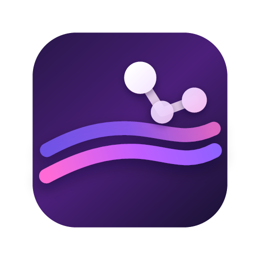

# PaintNode

PaintNode is an AI companion workspace for visual work. It gives local AI CLIs, such as Codex CLI and Antigravity, a real productive surface: a layered canvas, project assets, masks, selections, and OpenRaster (`.ora`) documents that can be edited, inspected, and handed back to the user.

Most creative AI tools either bundle their own image model or ask users to bring API keys. PaintNode takes a different path. It works with the AI command-line tools users already trust and already have configured, so the editor becomes the meeting place between human intent, existing AI subscriptions or local credentials, and a document that remains under the user's control.



## Product Direction

PaintNode is not intended to be another traditional image-editor alternative with AI sprinkled on top. The goal is to introduce a new workflow for model CLIs inside real creative tooling:

- The user keeps a normal layered document open.
- Codex CLI, Antigravity, and future local providers can work side by side.
- Each AI run can produce or modify project assets and document layers.
- The user reviews, edits, masks, composites, and exports the result in the same workspace.
- PaintNode does not host a model backend or add another API-billing layer.

The image editor surface matters because AI output needs a place to become production work. Layers, masks, file I/O, and OpenRaster compatibility are the shared canvas for that collaboration.

## Highlights

- Local AI companion flows for generation, fill, retouching, asset extraction, and workflow composition.
- Provider settings for existing local CLIs, including Codex CLI and Antigravity, with per-run overrides.
- Side-by-side AI work on the same project through separate assets, tasks, and layers.
- Layered OpenRaster (`.ora`) documents for portable, user-owned creative files.
- Local-first file I/O, PNG/PSD export paths, and project asset management.
- Tauri desktop app built with Svelte 5, TypeScript, Rust, and Canvas2D.
- macOS Quick Look extensions for ORA thumbnail and preview support.
- Signed app updates through Tauri updater and GitHub Releases.

## Status

PaintNode is in early MVP development. Public releases are intended to test the AI-companion workflow, local CLI integrations, document model, and packaging flow. The editor surface, provider contracts, and file compatibility are still evolving.

The current release channel is hosted on GitHub Releases:

```text
https://github.com/white-cornerstone/paintnode/releases
```

## Download

When public releases are available, download the latest build from:

[github.com/white-cornerstone/paintnode/releases/latest](https://github.com/white-cornerstone/paintnode/releases/latest)

macOS builds are signed and notarized by White Cornerstone Pty Ltd. PaintNode also checks GitHub Releases for signed Tauri updater metadata.

## Development

Requirements:

- Node.js 22 or newer
- Rust stable
- macOS for signed/notarized macOS release builds
- Optional local AI CLIs for AI features, such as Codex CLI or Antigravity

Install dependencies:

```bash
npm ci
```

Run the web development server:

```bash
npm run dev
```

Run the Tauri desktop app in development:

```bash
npm run tauri:dev
```

Build the static web app:

```bash
npm run build
```

Build the desktop app:

```bash
npm run tauri:build
```

For a local signed/notarized macOS release build, create `.env.macos-signing.local` with the required Apple and Tauri updater signing values, then run:

```bash
npm run tauri:build:mac:signed
```

## Quality Checks

Run both before publishing changes:

```bash
npm run check
npm test
```

`npm run check` must pass with 0 errors and 0 warnings.

## Repository Layout

```text
src/lib/engine/       framework-agnostic rendering and image logic
src/lib/state/        editor state, commands, settings, keyboard handling
src/lib/components/   Svelte UI components
src/lib/ora/          OpenRaster load/save
src/lib/icons/        Fluent System Icons registry
src-tauri/            Tauri shell, native commands, bundle configuration
docs/                 release and maintenance notes
```

## Release Flow

PaintNode releases are driven by tags named like:

```text
paintnode-v0.1.1
```

The GitHub Actions release workflow builds signed macOS app bundles, uploads installer assets, uploads updater artifacts, and publishes `latest.json` for the in-app updater.

See [docs/release.md](docs/release.md) for the signing secrets and release checklist.

## Security

Please report security issues privately. See [SECURITY.md](SECURITY.md).

## License

No open-source license has been selected yet. Until a license is added, all rights are reserved by White Cornerstone Pty Ltd.
